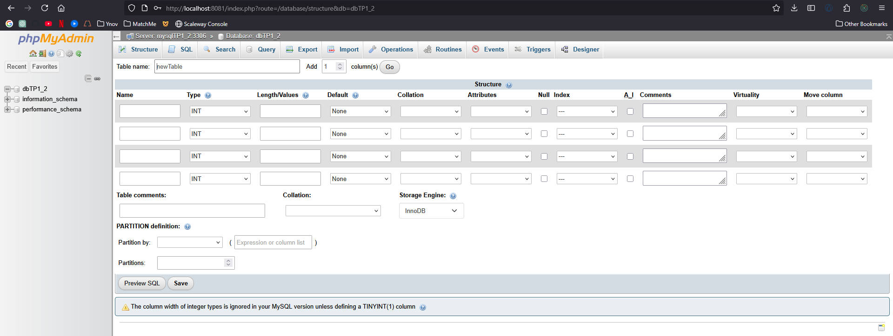

# TP1 - Docker

**Fanny Costes-Rossignol**

---

## 3. Exécuter un serveur web dans un container Docker

### a. Récupérer l’image nginx

```bash
docker pull nginx
```

---

### b. Vérifier que l’image est bien présente

```bash
docker images
```

REPOSITORY   TAG       IMAGE ID       CREATED        SIZE
nginx        latest    fb39280b7b9e   6 weeks ago    279MB

---

### c. Créer un fichier HTML

```bash
mkdir ./html
echo "Hello world" > ./html/index.html
```

---

### d. Lancer le container avec un montage de volume

```bash
docker run --name containerDocker -p 80:80 -v "C:\Users\fanny\Desktop\Ynov 24-25\Cours\devOps\html":/usr/share/nginx/html -d nginx
```

---

### e. Supprimer le container

```bash
docker rm -f containerDocker
```

---

### f. Relancer le container sans volume et copier le fichier

```bash
docker run --name containerDocker -d -p 80:80 nginx
docker cp ./html/index.html containerDocker:/usr/share/nginx/html/index.html
```

Successfully copied 2.05kB to containerDocker:/usr/share/nginx/html/index.html

---

## 4. Builder une image Docker personnalisée

### a. Contenu du Dockerfile

```Dockerfile
FROM nginx
COPY html/index.html /usr/share/nginx/html/index.html
EXPOSE 80
```

---

### b. Build & Run

```bash
docker build -t nginx .
docker run --name containerDocker -d -p 80:80 nginx
```

[+] Building 1.4s (8/8) FINISHED

---

### c. Comparaison des deux méthodes

- **Montage de volume**
  - Affichage instantané des modifications locales
  - Idéal pour le développement
- **Dockerfile (COPY)**
  - Rebuild + restart nécessaires
  - Image propre, plus adapté à la production

---

## 5. Utiliser une base de données dans un container Docker

### a. Télécharger les images nécessaires

```bash
docker pull mysql
docker pull phpmyadmin/phpmyadmin
```

---

### b. Exécuter les containers sur un même réseau Docker

```bash
docker network create networkTP1
```

**MySQL**

```bash
docker run --name mysqlTP1 --network networkTP1 -e MYSQL_ROOT_PASSWORD=password -e MYSQL_DATABASE=dbTP1 -e MYSQL_USER=admin -e MYSQL_PASSWORD=admin -d mysql
```

**phpMyAdmin**

```bash
docker run --name phpmyadminTP1 --network networkTP1 -e PMA_HOST=mysqlTP1 -d -p 8080:80 phpmyadmin/phpmyadmin
```

Résultat sur phpMyAdmin:  


---

## 6. Utilisation de `docker-compose.yml`

### a. Différences `docker run` vs `docker-compose`

#### `docker run` :
- Démarrage manuel de chaque conteneur
- Configuration manuelle des liens réseau
- Peu pratique dès qu’on a plusieurs services

#### `docker-compose` :
- Décrit tous les services dans un seul fichier .yml
- Crée automatiquement un réseau
- Gère les dépendances, les ports...

---

### b. Commandes principales

**RUN**

```bash
docker-compose up -d
```

**STOP**

```bash
docker-compose down
```

---

### c. Fichier `docker-compose.yml`

[Voir le fichier docker-compose.yml](docker-compose.yml)

Résultat sur phpMyAdmin :  

